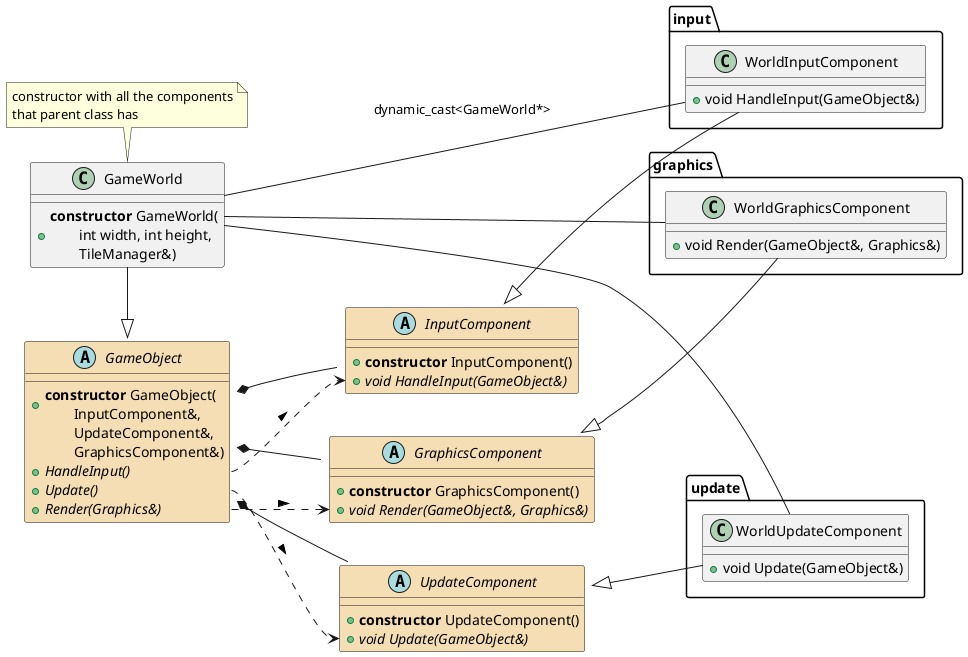

# Class Diagram - Raylib Game Project

# Graphics component
This is component structure of game object


# General data

This diagram shows the class structure and relationships in the raylib-my project!
```plantuml
@startuml class_diagram
skinparam pageMargin 10
skinparam pageExternalColor gray
skinparam pageBorderColor black

hide *

!include classes.iuml

show GameObject
show Menu
show GameWorld
show GameArea
show GameCamera
show WorldTile
show WorldTileTerrainType
show DecorationMenu
show TilesManager

hide protected members
hide private members

remove @unlinked
@enduml
```
