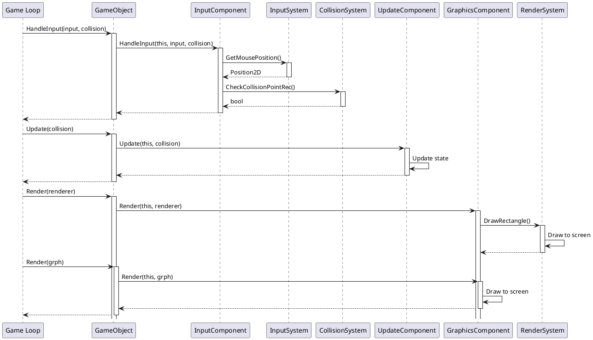

# Component Architecture

## Overview

The game uses a **Component-Based Architecture** where game objects delegate their behavior to specialized component objects. This separates concerns and enables flexible composition of behaviors.

**Updated:** January 19, 2026 - Now uses interface parameters for decoupled system access.

## Core Concept

Every `GameObject` owns three types of components:
- **InputComponent** - Handles input processing (receives `InputSystem&` and `CollisionSystem&`)
- **GraphicsComponent** - Handles rendering (receives `RenderSystem&`)
- **UpdateComponent** - Handles game logic updates (receives `CollisionSystem&`, optional)

## Class Hierarchy

```plantuml
@startuml
skinparam classAttributeIconSize 0

abstract class GameObject {
  # unique_ptr<InputComponent> inputComponent
  # unique_ptr<GraphicsComponent> graphicsComponent
  # unique_ptr<UpdateComponent> updateComponent
  --
  # GameObject(unique_ptr<Input>, unique_ptr<Graphics>, unique_ptr<Update>)
  + {abstract} HandleInput(InputSystem&, CollisionSystem&)
  + {abstract} Update(CollisionSystem&)
  + {abstract} Render(RenderSystem&)
}

abstract class InputComponent {
  + {abstract} HandleInput(GameObject&, InputSystem&, CollisionSystem&)
}

abstract class GraphicsComponent {
  + {abstract} Render(GameObject&, RenderSystem&)
}

abstract class UpdateComponent {
  + {abstract} Update(GameObject&, CollisionSystem&)
}

interface InputSystem {
  + GetMousePosition(): Position2D
  + IsKeyPressed(int): bool
  + IsKeyDown(int): bool
  + GetMouseWheelMove(): float
}

interface CollisionSystem {
  + CheckCollisionPointRec(Position2D, Rectangle2D): bool
  + CheckCollisionRecs(Rectangle2D, Rectangle2D): bool
}

interface RenderSystem {
  + BeginDrawing()
  + EndDrawing()
  + BeginMode2D()
  + EndMode2D()
  + DrawRectangle(Rectangle2D, Color2D)
  + GridToScreen(Position2D): Position2D
  + UpdateGrphCamera(GrphCamera)
}

class GameCamera
class Menu
class GameWorld
class WorldTile

class CameraInputComponent
class CameraGraphicsComponent
class TileInputComponent
class TileGraphicsComponent
class TileUpdateComponent

  GameObject *-- InputComponent
  GameObject *-- GraphicsComponent
  GameObject *-- UpdateComponent

  GameObject <|-- GameCamera
  GameObject <|-- Menu
  GameObject <|-- GameWorld
  GameObject <|-- WorldTile

InputComponent <|-- CameraInputComponent
InputComponent <|-- TileInputComponent
GraphicsComponent <|-- CameraGraphicsComponent
GraphicsComponent <|-- TileGraphicsComponent
UpdateComponent <|-- TileUpdateComponent

GameCamera ..> CameraInputComponent : uses
GameCamera ..> CameraGraphicsComponent : uses
WorldTile ..> TileInputComponent : uses
WorldTile ..> TileGraphicsComponent : uses
WorldTile ..> TileUpdateComponent : uses

@enduml
```



## Ownership Model

### RAII with `unique_ptr`

All components are owned via `std::unique_ptr`, ensuring:
- **Automatic cleanup** - No manual delete needed
- **Clear ownership** - Each GameObject uniquely owns its components
- **Exception safety** - Resources freed even if exceptions occur
- **Move-only semantics** - Components cannot be copied, only moved

```cpp
class GameObject {
protected:
  std::unique_ptr<InputComponent> inputComponent;
  std::unique_ptr<GraphicsComponent> graphicsComponent;
  std::unique_ptr<UpdateComponent> updateComponent;
};
```

## How It Works

### 1. Object Creation

Game objects are created with their components:

```cpp
// Creating a camera
auto camera = new GameCamera(
  std::make_unique<CameraInputComponent>(),
  std::make_unique<CameraGraphicsComponent>()
);

// Creating a tile
auto tile = new WorldTile(
  terrainType,
  position,
  std::make_unique<TileInputComponent>(),
  std::make_unique<TileUpdateComponent>(),
  std::make_unique<TileGraphicsComponent>()
);
```

### 2. Behavior Delegation

GameObject delegates to its components, passing system interfaces:

```cpp
void GameObject::HandleInput(InputSystem& input, CollisionSystem& collision) {
  if (inputComponent) {
    inputComponent->HandleInput(*this, input, collision);
  }
}

void GameObject::Render(RenderSystem& renderer) {
  if (graphicsComponent) {
    graphicsComponent->Render(*this, renderer);
  }
}

void GameObject::Update(CollisionSystem& collision) {
  if (updateComponent) {
    updateComponent->Update(*this, collision);
  }
}
```

### 3. Component Implementation

Components implement specific behavior using system interfaces:

```cpp
void TileGraphicsComponent::Render(GameObject& obj, RenderSystem& renderer) {
  WorldTile& tile = static_cast<WorldTile&>(obj);

  // Access tile data
  Position2D center = renderer.GridToScreen(tile.Pos);
  ImageHandle textureImage = tile.TextureImage();

  // Perform rendering using interface methods
  renderer.ImageDraw(renderer.GetDst(), textureImage, src, dst, Color2D::White());
  renderer.DrawDiamondFrame(center, Color2D::Black(), true, 1.0f);

  tile.Dirty = false;
}
```

**Key Change:** Components now receive **system interfaces** (`InputSystem&`, `CollisionSystem&`, `RenderSystem&`) instead of concrete `Graphics&`. This:
- ✅ Enables mocking for unit tests
- ✅ Decouples game logic from rendering implementation
- ✅ Follows Dependency Inversion Principle
- ✅ Makes the codebase portable to other graphics libraries

## Sequence Diagram



## Benefits

### ✅ Separation of Concerns
Each component handles one responsibility:
- Input components know nothing about rendering
- Graphics components don't handle input
- Update components focus only on game with mock implementations:
- Mock `InputSystem` to simulate user input
- Mock `RenderSystem` for headless testing
- Mock `CollisionSystem` to verify collision logic
- Test input handling without graphics initialization
- Test rendering without real display
- Unit tests can run in CI/CD without display serverferent game objects:
- Multiple objects can use the same component type
- Easy to create variations by swapping components

### ✅ RAII Compliance
- Automatic memory management
- Exception-safe resource handling
- No memory leaks possible
- Clear ownership semantics

### ✅ Testability
Components can be tested independently:
- Mock components for unit testing
- Test input handling without rendering
- Test rendering without game logic

### ✅ Extensibility
Add new behaviors without modifying existing code:
- Create new component types
- Compose with interface parameters)
tile.HandleInput(input, collision);  // → TileInputComponent::HandleInput(tile, input, collision)
tile.Update(collision);              // → TileUpdateComponent::Update(tile, collision)
tile.Render(renderer);               // → TileGraphicsComponent::Render(tile, renderer

WorldTile uses the component architecture fully:

```cpp
// Creation (in WorldTileTerrainType::NewTile)
return new WorldTile(
  *this,                                      // Terrain type reference
  pos,                                        // Position
  std::make_unique<TileInputComponent>(),    // Input handling
  std::make_unique<TileUpdateComponent>(),   // Game logic
  std::make_unique<TileGraphicsComponent>()  // Rendering
);

// Usage (automatic delegation)
tile.HandleInput();  // → TileInputComponent::HandleInput()
tile.Update();       // → TileUpdateComponent::Update()
tile.Render(grph);   // → TileGraphicsComponent::Render()
```

## Memory Layout

```
GameWorld
├── unique_ptr<InputComponent> ────→ WorldInputComponent
├── unique_ptr<UpdateComponent> ────→ WorldUpdateComponent
├── unique_ptr<GraphicsComponent> ──→ WorldGraphicsComponent
├── unique_ptr<GameCamera> camera
│   ├── unique_ptr<InputComponent> ────→ CameraInputComponent
│   ├── unique_ptr<UpdateComponent> ────→ CameraUpdateComponent
│   └── unique_ptr<GraphicsComponent> ──→ CameraGraphicsComponent
└── vector<unique_ptr<WorldTile>>
    ├── unique_ptr<WorldTile>[0]
    │   ├── unique_ptr<InputComponent> ────→ TileInputComponent
    │   ├── unique_ptr<GraphicsComponent> ──→ TileGraphicsComponent
    │   └── unique_ptr<UpdateComponent> ────→ TileUpdateComponent
    ├── unique_ptr<WorldTile>[1]
    │   └── ... (same structure)
    └── ...
```

All cleanup happens automatically when GameWorld is destroyed - no manual delete needed anywhere!

## Component Types

| Component Class | Used By | Purpose |
|----------------|---------|---------|
| `CameraInputComponent` | GameCamera | Handle camera movement and zoom |
| `CameraUpdateComponent` | GameCamera | Camera physics (currently none) |
| `CameraGraphicsComponent` | GameCamera | Render camera state |
| `WorldInputComponent` | GameWorld | Handle camera and tile input delegation |
| `WorldUpdateComponent` | GameWorld | Update all tiles |
| `WorldGraphicsComponent` | GameWorld | Render world grid and camera |
| `TileInputComponent` | WorldTile | Handle tile interaction (currently empty) |
| `TileUpdateComponent` | WorldTile | Update tile state (e.g., resource growth) |
| `TileGraphicsComponent` | WorldTile | Render tile texture and frame |
| `DecorationMenuInputComponent` | DecorationMenu | Handle menu input |
| `System Interfaces

### InputSystem
Provides platform-independent input access:
```cpp
class InputSystem {
  virtual Position2D GetMousePosition() const = 0;
  virtual bool IsKeyPressed(int key) const = 0;
  virtual bool IsMouseButtonPressed(int button) const = 0;
  virtual bool IsKeyDown(int key) const = 0;
  virtual float GetMouseWheelMove() const = 0;
};
```

### CollisionSystem
Provides collision detection:
```cpp
class CollisionSystem {
  virtual bool CheckCollisionPointRec(Position2D point, Rectangle2D rect) const = 0;
  virtual bool CheckCollisionRecs(Rectangle2D rec1, Rectangle2D rec2) const = 0;
};
```

### RenderSystem
Provides rendering operations:
```cpp
class RenderSystem {
  virtual void BeginDrawing() = 0;
  virtual void EndDrawing() = 0;
  virtual void BeginMode2D() = 0;
  virtual void EndMode2D() = 0;
  virtual void DrawRectangle(Rectangle2D rect, Color2D color) = 0;
  virtual Position2D GridToScreen(Position2D pos) = 0;
  virtual void UpdateGrphCamera(const GrphCamera& camera) = 0;
  // ... and more
};
```

### Graphics Implementation
`Graphics` class (in `graphics/raylib_graphics.h`) implements all three interfaces:
```cpp
class Graphics : public InputSystem,
                 public CollisionSystem,
                 public RenderSystem,
                 public ResourcesSystem {
  // Implements all interface methods using raylib internally
};
```

This allows passing `Graphics` as any of the interfaces to different components.

## Related Documentation

- [Task 02: Memory Management](tasks/task-02-memory-management.md) - ✅ DONE - RAII implementation details
- [Task 05: Abstract Raylib Dependencies](tasks/task-05-abstract-raylib.md) - ✅ Phase 3 DONE - Interface abstraction
## Related Documentation

- [Task 02: Memory Management](tasks/task-02-memory-management.md) - ✅ DONE - RAII implementation details
- [Game Interface Sorting](game_interface_sorting.md) - Index-based sorting for non-movable objects
- [Code Organization](CODE_ORGANIZATION.md) - Overall code structure
