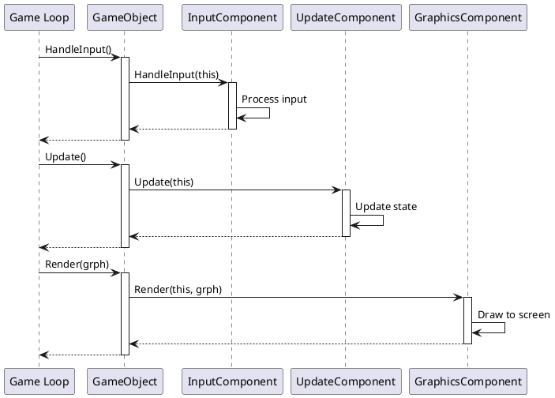

# Component Architecture

## Overview

The game uses a **Component-Based Architecture** where game objects delegate their behavior to specialized component objects. This separates concerns and enables flexible composition of behaviors.

## Core Concept

Every `GameObject` owns three types of components:
- **InputComponent** - Handles input processing
- **GraphicsComponent** - Handles rendering
- **UpdateComponent** - Handles game logic updates (optional)

## Class Hierarchy

```plantuml
@startuml
skinparam classAttributeIconSize 0

abstract class GameObject {
  # unique_ptr<InputComponent> inputComponent
  # unique_ptr<GraphicsComponent> graphicsComponent
  # unique_ptr<UpdateComponent> updateComponent
  --
  # GameObject(unique_ptr<Input>, unique_ptr<Graphics>, unique_ptr<Update>)
  + {abstract} HandleInput()
  + {abstract} Update()
  + {abstract} Render(Graphics&)
}

abstract class InputComponent {
  + {abstract} HandleInput(GameObject&)
}

abstract class GraphicsComponent {
  + {abstract} Render(GameObject&, Graphics&)
}

abstract class UpdateComponent {
  + {abstract} Update(GameObject&)
}

class GameCamera
class Menu
class GameWorld
class WorldTile

class CameraInputComponent
class CameraGraphicsComponent
class TileInputComponent
class TileGraphicsComponent
class TileUpdateComponent

  GameObject *-- InputComponent
  GameObject *-- GraphicsComponent
  GameObject *-- UpdateComponent

  GameObject <|-- GameCamera
  GameObject <|-- Menu
  GameObject <|-- GameWorld
  GameObject <|-- WorldTile

InputComponent <|-- CameraInputComponent
InputComponent <|-- TileInputComponent
GraphicsComponent <|-- CameraGraphicsComponent
GraphicsComponent <|-- TileGraphicsComponent
UpdateComponent <|-- TileUpdateComponent

GameCamera ..> CameraInputComponent : uses
GameCamera ..> CameraGraphicsComponent : uses
WorldTile ..> TileInputComponent : uses
WorldTile ..> TileGraphicsComponent : uses
WorldTile ..> TileUpdateComponent : uses

@enduml
```



## Ownership Model

### RAII with `unique_ptr`

All components are owned via `std::unique_ptr`, ensuring:
- **Automatic cleanup** - No manual delete needed
- **Clear ownership** - Each GameObject uniquely owns its components
- **Exception safety** - Resources freed even if exceptions occur
- **Move-only semantics** - Components cannot be copied, only moved

```cpp
class GameObject {
protected:
  std::unique_ptr<InputComponent> inputComponent;
  std::unique_ptr<GraphicsComponent> graphicsComponent;
  std::unique_ptr<UpdateComponent> updateComponent;
};
```

## How It Works

### 1. Object Creation

Game objects are created with their components:

```cpp
// Creating a camera
auto camera = new GameCamera(
  std::make_unique<CameraInputComponent>(),
  std::make_unique<CameraGraphicsComponent>()
);

// Creating a tile
auto tile = new WorldTile(
  terrainType,
  position,
  std::make_unique<TileInputComponent>(),
  std::make_unique<TileUpdateComponent>(),
  std::make_unique<TileGraphicsComponent>()
);
```

### 2. Behavior Delegation

GameObject delegates to its components:

```cpp
void GameObject::HandleInput() {
  if (inputComponent) {
    inputComponent->HandleInput(*this);
  }
}

void GameObject::Render(Graphics& grph) {
  if (graphicsComponent) {
    graphicsComponent->Render(*this, grph);
  }
}

void GameObject::Update() {
  if (updateComponent) {
    updateComponent->Update(*this);
  }
}
```

### 3. Component Implementation

Components implement specific behavior:

```cpp
void TileGraphicsComponent::Render(GameObject& obj, Graphics& grph) {
  WorldTile& tile = static_cast<WorldTile&>(obj);

  // Access tile data
  Position2D center = grph.GridToScreen(tile.Pos);
  const Texture2D& texture = tile.Texture();

  // Perform rendering
  ImageDraw(grph.Dst, tile.TextureImage(), src, dst, WHITE);
  grph.DrawDiamondFrame(center, BLACK, true, 1.0f);

  tile.Dirty = false;
}
```

## Sequence Diagram



## Benefits

### ✅ Separation of Concerns
Each component handles one responsibility:
- Input components know nothing about rendering
- Graphics components don't handle input
- Update components focus only on game logic

### ✅ Reusability
Components can be reused across different game objects:
- Multiple objects can use the same component type
- Easy to create variations by swapping components

### ✅ RAII Compliance
- Automatic memory management
- Exception-safe resource handling
- No memory leaks possible
- Clear ownership semantics

### ✅ Testability
Components can be tested independently:
- Mock components for unit testing
- Test input handling without rendering
- Test rendering without game logic

### ✅ Extensibility
Add new behaviors without modifying existing code:
- Create new component types
- Compose different component combinations
- Override specific components for specialization

## Example: WorldTile

WorldTile uses the component architecture fully:

```cpp
// Creation (in WorldTileTerrainType::NewTile)
return new WorldTile(
  *this,                                      // Terrain type reference
  pos,                                        // Position
  std::make_unique<TileInputComponent>(),    // Input handling
  std::make_unique<TileUpdateComponent>(),   // Game logic
  std::make_unique<TileGraphicsComponent>()  // Rendering
);

// Usage (automatic delegation)
tile.HandleInput();  // → TileInputComponent::HandleInput()
tile.Update();       // → TileUpdateComponent::Update()
tile.Render(grph);   // → TileGraphicsComponent::Render()
```

## Memory Layout

```
GameWorld
├── unique_ptr<InputComponent> ────→ WorldInputComponent
├── unique_ptr<GraphicsComponent> ──→ WorldGraphicsComponent
└── vector<unique_ptr<WorldTile>>
    ├── unique_ptr<WorldTile>[0]
    │   ├── unique_ptr<InputComponent> ────→ TileInputComponent
    │   ├── unique_ptr<GraphicsComponent> ──→ TileGraphicsComponent
    │   └── unique_ptr<UpdateComponent> ────→ TileUpdateComponent
    ├── unique_ptr<WorldTile>[1]
    │   └── ... (same structure)
    └── ...
```

All cleanup happens automatically when GameWorld is destroyed - no manual delete needed anywhere!

## Component Types

| Component Class | Used By | Purpose |
|----------------|---------|---------|
| `CameraInputComponent` | GameCamera | Handle camera movement and zoom |
| `CameraGraphicsComponent` | GameCamera | Render camera state |
| `WorldInputComponent` | GameWorld | Handle world-level input |
| `WorldGraphicsComponent` | GameWorld | Render world grid |
| `TileInputComponent` | WorldTile | Handle tile interaction (currently empty) |
| `TileUpdateComponent` | WorldTile | Update tile state (e.g., resource growth) |
| `TileGraphicsComponent` | WorldTile | Render tile texture and frame |
| `DecorationMenuInputComponent` | DecorationMenu | Handle menu input |
| `DecorationMenuUpdateComponent` | DecorationMenu | Update menu state |
| `DecorationMenuGraphicsComponent` | DecorationMenu | Render menu UI |

## Related Documentation

- [Task 02: Memory Management](tasks/task-02-memory-management.md) - RAII implementation details
- [Game Interface Sorting](game_interface_sorting.md) - Index-based sorting for non-movable objects
- [Code Organization](CODE_ORGANIZATION.md) - Overall code structure
