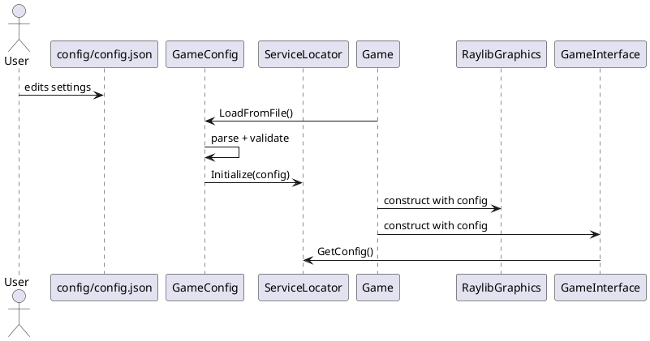

# Configuration Overview

This project uses a JSON-backed configuration that is loaded at startup and stored in the ServiceLocator for global access. The goal is to eliminate hard-coded values and allow strict, validated runtime settings.

## Process (Brief)

1. Provide defaults in `GameConfig`.
2. Load `config/config.json` at startup.
3. Validate required fields strictly; fail fast on errors.
4. Store config in `ServiceLocator` for global access.
5. Use config values in systems (graphics, world sizing, etc.).

## Decisions and Approaches

- JSON library: nlohmann/json via CMake FetchContent.
- Config location: `raylib-my/config/config.json`, copied to build output by CMake.
- Access pattern: ServiceLocator stores `GameConfig` instance.
- Validation: strict (missing or invalid fields are errors).
- Window title is also configurable.

## Flow Diagram (PlantUML)

