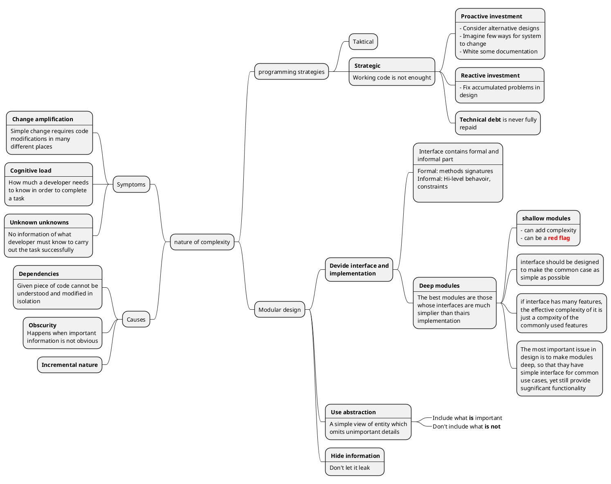
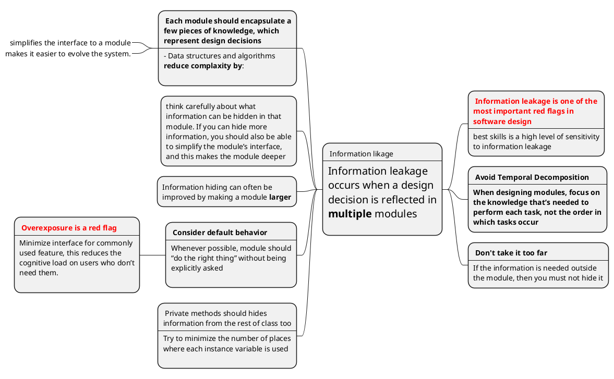

## A Philosophy of Software Design Abstracts

```plantuml
@startmindmap
left to right direction

<style>
  node {
    MaximumWidth 200
  }
</style>
* nature of complexity

left side
** Symptoms
***: <b>Change amplification</b>
----
Simple change requires code modifications in many different places;
***: <b>Cognitive load</b>
----
How much a developer needs to know in order to complete a task;
***: <b>Unknown unknowns</b>
----
No information of what developer must know to carry out the task successfully;

** Causes
***: <b>Dependencies</b>
----
Given piece of code cannot be understood and modified in isolation;
***: <b>Obscurity</b>
Happens when important information is not obvious;
*** <b>Incremental nature</b>

right side
** programming strategies
*** Taktical
***: <b>Strategic</b>
----
Working code is not enought;
****: <b>Proactive investment</b>
----
- Consider alternative designs
- Imagine few ways for system to change
- White some documentation;
****: <b>Reactive investment</b>
----
- Fix accumulated problems in design;
**** <b>Technical debt</b> is never fully repaid

** Modular design
*** <b>Devide interface and implementation</b>
****: Interface contains formal and informal part
----
Formal: methods signatures
Informal: Hi-level behavoir, constraints
;
****: <b>Deep modules</b>
----
The best modules are those whose interfaces are much simplier than thairs implementation;
*****: <b>shallow modules</b>
----
- can add complexity
- can be a <b><color:red>red flag</color></b>;
***** interface should be designed to make the common case as simple as possible
***** if interface has many features, the effective complexity of it is just a compxity of the commonly used features
***** The most important issue in design is to make modules deep, so that thay have simple interface for common use cases, yet still provide sugnificant functionality

***: <b>Use abstraction</b>
----
A simple view of entity which omits unimportant details;
****_ Include what <b>is</b> important
****_ Don't include what <b>is not</b>

***: <b>Hide information</b>
----
Don't let it leak;


@endmindmap
```
## Information likage

```plantuml
@startmindmap
left to right direction

<style>
  node {
    MaximumWidth 250
  }
</style>
*: Information likage
----
<size:20>Information leakage occurs when a design decision is reflected in <b>multiple</b> modules</size>
;

left side
**: <b>Each module should encapsulate a few pieces of knowledge, which represent design decisions</b>
----
- Data structures and algorithms
<b>reduce complaxity by</b>:
;

***_ simplifies the interface to a module
***_ makes it easier to evolve the system.
** think carefully about what information can be hidden in that module. If you can hide more information, you should also be able to simplify the module’s interface, and this makes the module deeper

** Information hiding can often be improved by making a module <b>larger</b>

**: <b>Consider default behavior</b>
----
Whenever possible, module should “do the right thing” without being explicitly asked
;
***: <b><color:red>Overexposure is a red flag</color></b>
----
Minimize interface for commonly used feature, this reduces the cognitive load on users who don’t need them.
;

**: Private methods should hides information from the rest of class too
----
Try to minimize the number of places where each instance variable is used
;

right side
**: <b><color:red>Information leakage is one of the most important red flags in software design</color></b>
----
best skills is a high level of sensitivity to information leakage;


**: <b>Avoid Temporal Decomposition</b>
----
<b>When designing modules, focus on the knowledge that’s needed to perform each task, not the order in which tasks occur</b>;


**: <b>Don't take it too far</b>
----
If the information is needed outside the module, then you must not hide it;

@endmindmap
```
