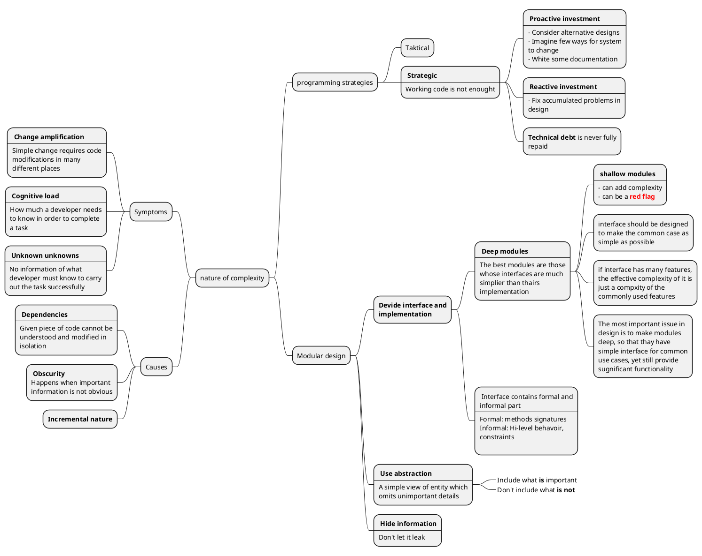

## A Philosophy of Software Design Abstracts

```plantuml
@startmindmap
left to right direction

<style>
  node {
    MaximumWidth 200
  }
</style>
* nature of complexity

left side
** Symptoms
***: <b>Change amplification</b>
----
Simple change requires code modifications in many different places;
***: <b>Cognitive load</b>
----
How much a developer needs to know in order to complete a task;
***: <b>Unknown unknowns</b>
----
No information of what developer must know to carry out the task successfully;

** Causes
***: <b>Dependencies</b>
----
Given piece of code cannot be understood and modified in isolation;
***: <b>Obscurity</b>
Happens when important information is not obvious;
*** <b>Incremental nature</b>

right side
** programming strategies
*** Taktical
***: <b>Strategic</b>
----
Working code is not enought;
****: <b>Proactive investment</b>
----
- Consider alternative designs
- Imagine few ways for system to change
- White some documentation;
****: <b>Reactive investment</b>
----
- Fix accumulated problems in design;
**** <b>Technical debt</b> is never fully repaid

** Modular design
*** <b>Devide interface and implementation</b>
****: <b>Deep modules</b>
----
The best modules are those whose interfaces are much simplier than thairs implementation;
*****: <b>shallow modules</b>
----
- can add complexity
- can be a <b><color:red>red flag</color></b>;
***** interface should be designed to make the common case as simple as possible
***** if interface has many features, the effective complexity of it is just a compxity of the commonly used features
***** The most important issue in design is to make modules deep, so that thay have simple interface for common use cases, yet still provide sugnificant functionality
****: Interface contains formal and informal part
----
Formal: methods signatures
Informal: Hi-level behavoir, constraints
;
***: <b>Use abstraction</b>
----
A simple view of entity which omits unimportant details;
****_ Include what <b>is</b> important
****_ Don't include what <b>is not</b>

***: <b>Hide information</b>
----
Don't let it leak;
@endmindmap
```

