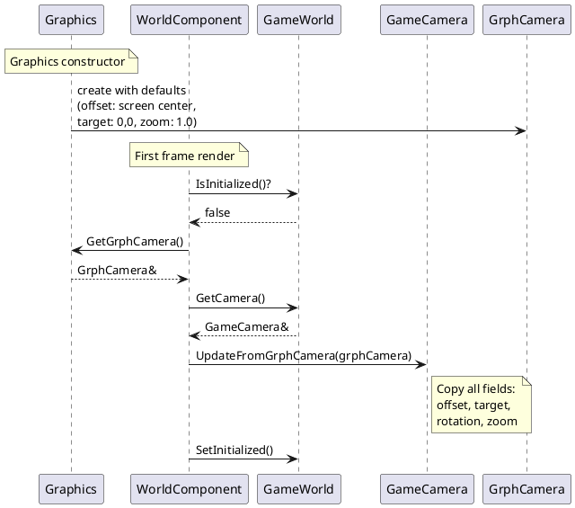
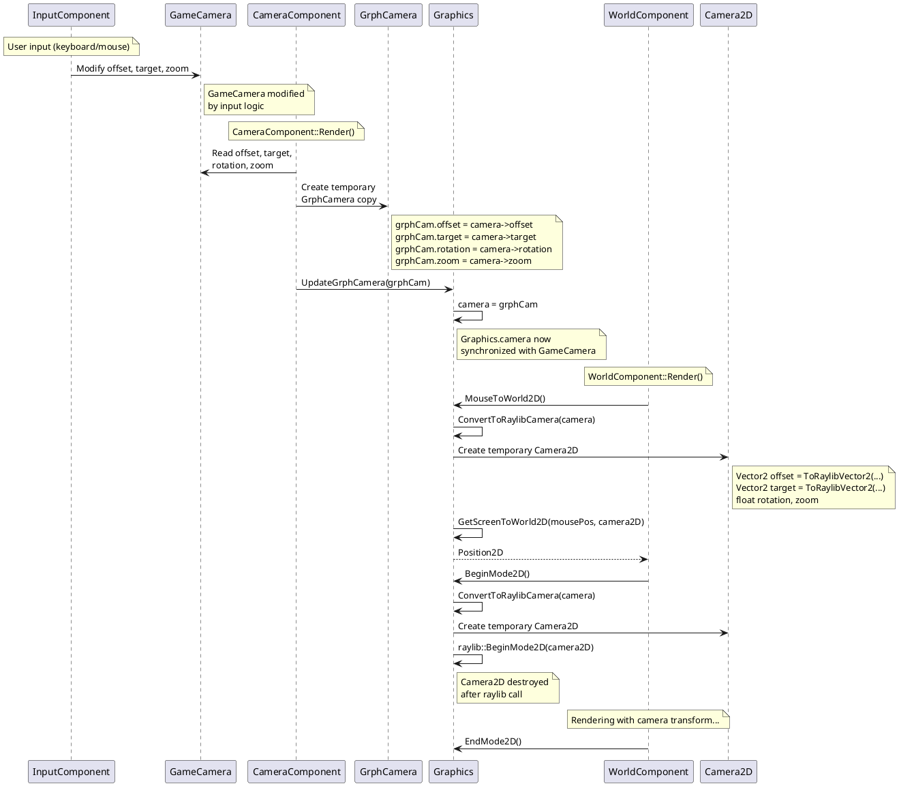

# GrphCamera - Platform-Independent Camera System

**Last Updated:** January 19, 2026

## Overview

`GrphCamera` is a platform-independent camera representation that decouples the game's camera state from raylib's `Camera2D` type. This is part of the broader effort to abstract raylib dependencies from the game logic.

## Camera Collaboration

The camera system uses three distinct types that work together:

- **GameCamera**: Game logic camera with Position2D members (offset, target) and float properties (rotation, zoom). Modified by input components and used by game logic.
- **GrphCamera**: Platform-independent camera stored in Graphics class. Acts as the authoritative state for rendering operations.
- **Camera2D**: Raylib's camera type with Vector2 members. Created on-demand only when raylib rendering functions need it.

**Data Flow**: GameCamera → GrphCamera (via conversion) → Camera2D (temporary, for raylib calls)

The Graphics class maintains GrphCamera internally and converts it to Camera2D only at the rendering boundary (BeginMode2D, MouseToWorld2D). This keeps game logic completely independent of raylib types.

## Architecture

### Class Hierarchy

```
GrphCamera (common/grph_camera.h)
    ↓ stored in
Graphics (graphics.h)
    ↑ read from
GameWorld → GameCamera
```

### Data Flow

```
Game Loop Cycle:
1. World Component Initialization:
   GameWorld.IsInitialized() = false
   → Read GrphCamera from Graphics
   → Update GameCamera with GrphCamera state
   → Mark world as initialized

2. Camera Component Render (every frame):
   GameCamera (updated by input)
   → Convert to GrphCamera
   → Update Graphics.camera

3. Rendering Operations:
   Graphics.camera (GrphCamera)
   → Convert to raylib Camera2D (only when needed)
   → Use for BeginMode2D(), MouseToWorld2D(), etc.
```

## UML Sequence Diagrams

### Initialization Sequence



### Update Sequence (Every Frame)



## Key Classes

### GrphCamera (`common/grph_camera.h`)

Platform-independent camera state container.

```cpp
class GrphCamera {
public:
  Position2D offset;      // Camera offset (displacement from target)
  Position2D target;      // Camera target (rotation and zoom origin)
  float rotation;         // Camera rotation in degrees
  float zoom;             // Camera zoom (scaling)
};
```

**Purpose:** Store camera state without depending on raylib types.

### Graphics Camera Management

Graphics maintains the authoritative camera state:

```cpp
class Graphics {
private:
  GrphCamera camera;  // Platform-independent camera state

public:
  void UpdateGrphCamera(const GrphCamera& grphCamera);
  const GrphCamera& GetGrphCamera() const;
  GrphCamera& GetGrphCamera();
  void BeginMode2D();  // Uses internal camera
  Position2D MouseToWorld2D();  // Uses internal camera
};
```

### GameCamera (`game_camera.h`)

Game's camera object that can be updated from Graphics:

```cpp
class GameCamera {
  void UpdateFromGrphCamera(const GrphCamera& grphCamera);
};
```

## Implementation Details

### Initialization Flow

Located in `graphics_components/world_component.cpp`:

```cpp
void WorldGraphicsComponent::Render(GameObject& wld, Graphics& grph) {
  GameWorld* world = dynamic_cast<GameWorld*>(&wld);

  if (!world->IsInitialized()) {
    // Initialize GameCamera from Graphics camera state
    world->GetCamera().UpdateFromGrphCamera(grph.GetGrphCamera());
    world->SetInitialized();
  }

  // ... rest of rendering
}
```

**Why:** Ensures GameCamera starts with the same state as Graphics camera (initialized to screen center).

### Update Flow

Located in `graphics_components/camera_component.cpp`:

```cpp
void CameraGraphicsComponent::Render(GameObject& cam, Graphics& grph) {
  GameCamera* camera = dynamic_cast<GameCamera*>(&cam);

  // Convert GameCamera to GrphCamera
  GrphCamera grphCam;
  grphCam.offset = camera->offset;
  grphCam.target = camera->target;
  grphCam.rotation = camera->rotation;
  grphCam.zoom = camera->zoom;

  // Sync to Graphics camera
  grph.UpdateGrphCamera(grphCam);
}
```

**Why:** GameCamera is modified by input components, so we convert and update Graphics camera before any rendering operations.

### Conversion to Raylib

Located in `graphics.cpp`:

```cpp
Camera2D Graphics::ConvertToRaylibCamera(const GrphCamera& grphCamera) const {
  return Camera2D {
    ToRaylibVector2(grphCamera.offset),
    ToRaylibVector2(grphCamera.target),
    grphCamera.rotation,
    grphCamera.zoom
  };
}
```

Used in:
- `BeginMode2D()` - Sets up 2D camera for rendering
- `MouseToWorld2D()` - Converts mouse position to world coordinates

**Why:** Conversion happens only at the boundary with raylib, keeping game logic independent.

## Benefits

1. **Platform Independence**: Game camera logic doesn't depend on raylib types
2. **Single Source of Truth**: Graphics maintains the authoritative camera state
3. **Clean Conversion**: Raylib types created only when needed for rendering
4. **Testability**: Can mock Graphics without raylib initialization
5. **Flexibility**: Easy to change rendering backend in the future

## Timing and Synchronization

### Frame Sequence

```
Frame N:
1. Input Phase:
   - User input modifies GameCamera.target, GameCamera.zoom, etc.

2. Update Phase:
   - Game logic updates (using GameCamera state)

3. Render Phase:
   a. CameraGraphicsComponent::Render()
      → Updates Graphics.camera from GameCamera
   b. WorldGraphicsComponent::Render()
      → Uses Graphics.camera for rendering operations
      → Converts to raylib Camera2D when calling BeginMode2D()
```

### Initialization (Frame 0)

```
First Frame Only:
1. Graphics constructor:
   → Initializes GrphCamera with default values
   → offset = {ScreenWidth/2, ScreenHeight/4}
   → target = {0, 0}, rotation = 0, zoom = 1.0

2. WorldGraphicsComponent first render:
   → Reads GrphCamera from Graphics
   → Updates GameCamera with these initial values
   → Marks world as initialized
```

## Related Files

- `common/grph_camera.h/cpp` - GrphCamera class definition
- `graphics.h/cpp` - Camera storage and conversion
- `game_camera.h/cpp` - Game camera with UpdateFromGrphCamera()
- `graphics_components/camera_component.cpp` - Updates GrphCamera from GameCamera
- `graphics_components/world_component.cpp` - Initializes GameCamera from GrphCamera

## Future Improvements

1. **Interface Abstraction**: Replace GrphCamera direct usage with ICameraSystem interface
2. **Camera Controller**: Separate camera input logic from GameCamera
3. **Multiple Cameras**: Support multiple camera instances for split-screen or picture-in-picture
4. **Camera Interpolation**: Smooth camera transitions

## See Also

- [CODE_ORGANIZATION.md](CODE_ORGANIZATION.md) - Code organization standards
- [component_architecture.md](component_architecture.md) - Component pattern usage
- [tasks/task-05-abstract-raylib.md](tasks/task-05-abstract-raylib.md) - Raylib abstraction effort
