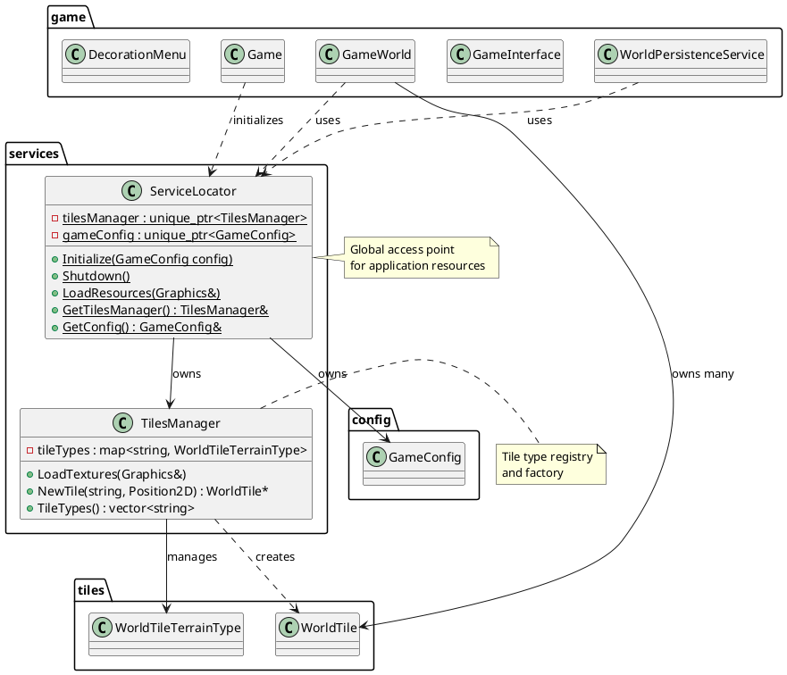
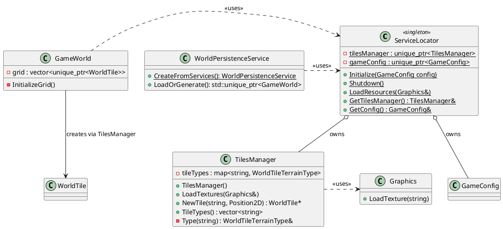
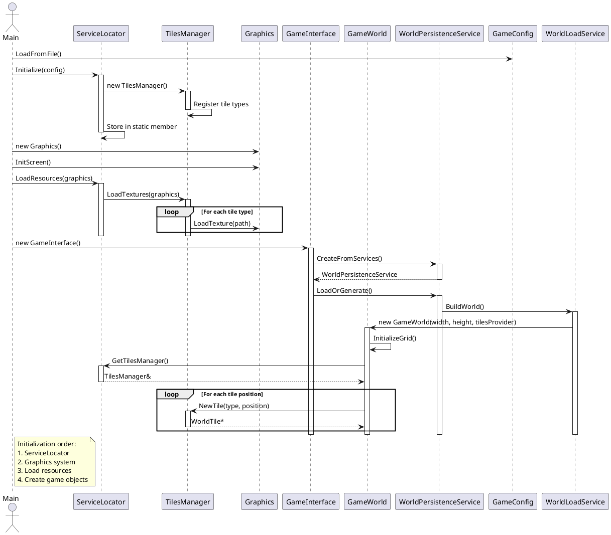
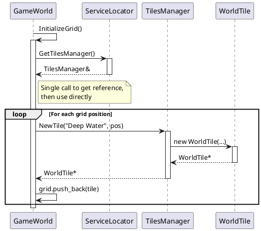
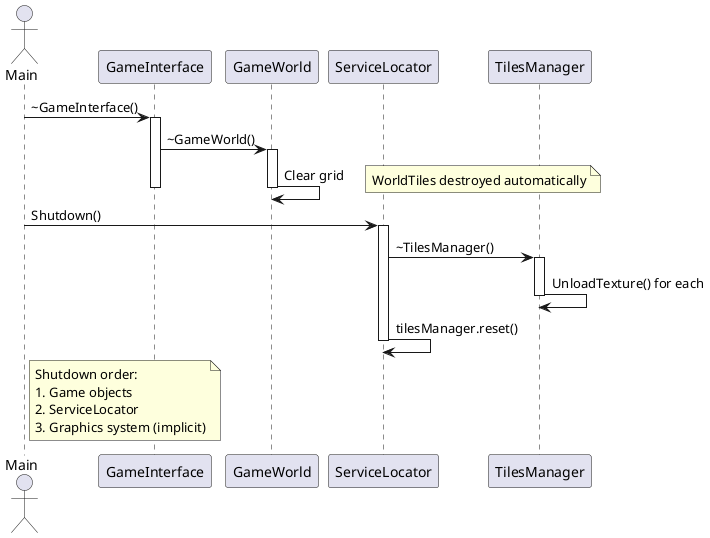

# Service Locator Pattern

## Overview

The Service Locator pattern provides centralized access to application-wide resources and services. It decouples resource consumers from resource providers, eliminating the need to pass resources through constructor chains.

## Architecture

### Package Dependencies



### Class Relationships



## Initialization Sequence



## Runtime Usage



## Shutdown Sequence



## Usage Examples

### Getting TilesManager

```cpp
auto persistence = WorldPersistenceService::CreateFromServices();
auto world = persistence.LoadOrGenerate();
```

### Initialization in Main

```cpp
int main() {
  auto config = GameConfig::LoadFromFile("config/config.json");
  ServiceLocator::Initialize(config);

  Graphics graphics{1024, 768, 64, 32, "Game", 60};
  graphics.InitScreen();

  ServiceLocator::LoadResources(graphics);

  GameInterface interface{1024, 768};

  while (!graphics.Done()) {
    interface.HandleInput();
    interface.Update();
    interface.Render(graphics);
  }

  ServiceLocator::Shutdown();
  return 0;
}
```

## Benefits

### Decoupling
- GameWorld doesn't depend on GameInterface to access TilesManager
- No need to pass TilesManager through constructor chains
- Easy to test components in isolation

### Centralized Lifecycle
- Single initialization point for all services
- Clear shutdown order
- Resources loaded once, used everywhere

### Scalability
- Easy to add new services (AudioManager, ConfigManager, etc.)
- No need to modify existing constructors
- Services can be mocked for testing

## Design Decisions

### Why Static Methods?

Global access needed for truly application-wide resources. Alternative would be passing ServiceLocator everywhere, which is more verbose.

### Why unique_ptr?

Clear ownership - ServiceLocator owns the TilesManager lifetime. Automatic cleanup in Shutdown().

### Why Not Singleton?

ServiceLocator allows controlled initialization/shutdown and can be replaced with mock implementations for testing. Pure singleton would be harder to test.

### Why TilesManager as Service?

TilesManager is:
- Application-level resource (not per-scene)
- Immutable after initialization
- Needed by multiple disconnected systems
- Resource registry + factory

This makes it ideal for ServiceLocator management.

## Adding New Services

To add a new service to ServiceLocator:

1. Add member variable:
```cpp
class ServiceLocator {
private:
  static std::unique_ptr<TilesManager> tilesManager;
  static std::unique_ptr<AudioManager> audioManager;  // New
};
```

2. Initialize in Initialize():
```cpp
void ServiceLocator::Initialize() {
  tilesManager = std::make_unique<TilesManager>();
  audioManager = std::make_unique<AudioManager>();  // New
}
```

3. Add getter:
```cpp
static AudioManager& GetAudioManager();
```

4. Implement getter:
```cpp
AudioManager& ServiceLocator::GetAudioManager() {
  assert(audioManager != nullptr);
  return *audioManager;
}
```

5. Clean up in Shutdown():
```cpp
void ServiceLocator::Shutdown() {
  audioManager.reset();  // New - order matters!
  tilesManager.reset();
}
```

## Files

- [services/service_locator.h](../src/services/service_locator.h)
- [services/service_locator.cpp](../src/services/service_locator.cpp)
- [services/tiles_manager.h](../src/services/tiles_manager.h)
- [services/tiles_manager.cpp](../src/services/tiles_manager.cpp)
