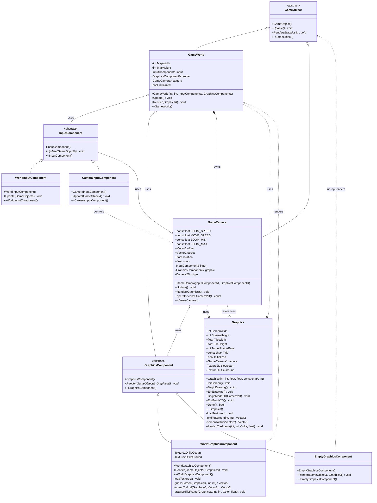

%%Diagrams

```mermaid
classDiagram
    %% Core Abstract Classes
    class GameObject {
        <<abstract>>
        +GameObject()
        +Update()* void
        +Render(Graphics&)* void
        +~GameObject()
    }

    class InputComponent {
        <<abstract>>
        +InputComponent()
        +Update(GameObject&)* void
        +~InputComponent()
    }

    class GraphicsComponent {
        <<abstract>>
        +GraphicsComponent()
        +Render(GameObject&, Graphics&)* void
        +~GraphicsComponent()
    }

    %% Main Classes
    class Graphics {
        +int ScreenWidh
        +int ScreenHeight
        +float TileWidth
        +float TileHeight
        +int TargetFrameRate
        +const char* Title
        +bool Initialized
        +GameCamera* camera
        +Graphics(int, int, float, float, const char*, int)
        +InitScreen() void
        +BeginDrawing() void
        +EndDrawing() void
        +BeginMode2D(Camera2D) void
        +EndMode2D() void
        +Done() bool
        +~Graphics()
        -Texture2D tileOcean
        -Texture2D tileGround
        -loadTextures() void
        -gridToScreen(int, int) Vector2
        -screenToGrid(Vector2) Vector2
        -drawIsoTileFrame(int, int, Color, float) void
    }

    class GameWorld {
        +int MapWidth
        +int MapHeight
        +GameWorld(int, int, InputComponent&, GraphicsComponent&)
        +Update() void
        +Render(Graphics&) void
        +~GameWorld()
        -InputComponent& input
        -GraphicsComponent& render
        -GameCamera* camera
        -bool initialized
    }

    class GameCamera {
        +const float ZOOM_SPEED
        +const float MOVE_SPEED
        +const float ZOOM_MIN
        +const float ZOOM_MAX
        +Vector2 offset
        +Vector2 target
        +float rotation
        +float zoom
        +GameCamera(InputComponent&, GraphicsComponent&)
        +Update() void
        +Render(Graphics&) void
        +operator const Camera2D() const
        +~GameCamera()
        -InputComponent& input
        -GraphicsComponent& graphic
        -Camera2D origin
    }

    %% Input Components
    class WorldInputComponent {
        +WorldInputComponent()
        +Update(GameObject&) void
        +~WorldInputComponent()
    }

    class CameraInputComponent {
        +CameraInputComponent()
        +Update(GameObject&) void
        +~CameraInputComponent()
    }

    %% Graphics Components
    class WorldGraphicsComponent {
        +WorldGraphicsComponent()
        +Render(GameObject&, Graphics&) void
        +~WorldGraphicsComponent()
        -Texture2D tileOcean
        -Texture2D tileGround
        -loadTextures() void
        -gridToScreen(Graphics&, int, int) Vector2
        -screenToGrid(Graphics&, Vector2) Vector2
        -drawIsoTileFrame(Graphics&, int, int, Color, float) void
    }

    class EmptyGraphicsComponent {
        +EmptyGraphicsComponent()
        +Render(GameObject&, Graphics&) void
        +~EmptyGraphicsComponent()
    }

    %% Inheritance Relationships
    GameObject <|-- GameWorld
    GameObject <|-- GameCamera
    InputComponent <|-- WorldInputComponent
    InputComponent <|-- CameraInputComponent
    GraphicsComponent <|-- WorldGraphicsComponent
    GraphicsComponent <|-- EmptyGraphicsComponent

    %% Composition & Association Relationships
    GameWorld o-- InputComponent : uses
    GameWorld o-- GraphicsComponent : uses
    GameWorld *-- GameCamera : owns
    GameCamera o-- InputComponent : uses
    GameCamera o-- GraphicsComponent : uses
    Graphics o-- GameCamera : references
    GameWorld ..> Graphics : uses
    GameCamera ..> Graphics : uses
    WorldGraphicsComponent ..> GameWorld : renders
    CameraInputComponent ..> GameCamera : controls
    EmptyGraphicsComponent ..> GameObject : no-op renders
```

%%Comprehensive Mermaid class diagram for your raylib-my project

```mermaid

classDiagram
    %% Core Abstract Classes
    class GameObject {
        <<abstract>>
        +GameObject()
        +Update()* void
        +Render(Graphics&)* void
        +~GameObject()
    }

    class InputComponent {
        <<abstract>>
        +InputComponent()
        +Update(GameObject&)* void
        +~InputComponent()
    }

    class GraphicsComponent {
        <<abstract>>
        +GraphicsComponent()
        +Render(GameObject&, Graphics&)* void
        +~GraphicsComponent()
    }

    %% Main Classes
    class Graphics {
        +int ScreenWidh
        +int ScreenHeight
        +float TileWidth
        +float TileHeight
        +int TargetFrameRate
        +const char* Title
        +bool Initialized
        +GameCamera* camera
        +Graphics(int, int, float, float, const char*, int)
        +InitScreen() void
        +BeginDrawing() void
        +EndDrawing() void
        +BeginMode2D(Camera2D) void
        +EndMode2D() void
        +Done() bool
        +~Graphics()
        -Texture2D tileOcean
        -Texture2D tileGround
        -loadTextures() void
        -gridToScreen(int, int) Vector2
        -screenToGrid(Vector2) Vector2
        -drawIsoTileFrame(int, int, Color, float) void
    }

    class GameWorld {
        +int MapWidth
        +int MapHeight
        +GameWorld(int, int, InputComponent&, GraphicsComponent&)
        +Update() void
        +Render(Graphics&) void
        +~GameWorld()
        -InputComponent& input
        -GraphicsComponent& render
        -GameCamera* camera
        -bool initialized
    }

    class GameCamera {
        +const float ZOOM_SPEED
        +const float MOVE_SPEED
        +const float ZOOM_MIN
        +const float ZOOM_MAX
        +Vector2 offset
        +Vector2 target
        +float rotation
        +float zoom
        +GameCamera(InputComponent&, GraphicsComponent&)
        +Update() void
        +Render(Graphics&) void
        +operator const Camera2D() const
        +~GameCamera()
        -InputComponent& input
        -GraphicsComponent& graphic
        -Camera2D origin
    }

    %% Input Components
    class WorldInputComponent {
        +WorldInputComponent()
        +Update(GameObject&) void
        +~WorldInputComponent()
    }

    class CameraInputComponent {
        +CameraInputComponent()
        +Update(GameObject&) void
        +~CameraInputComponent()
    }

    %% Graphics Components
    class WorldGraphicsComponent {
        +WorldGraphicsComponent()
        +Render(GameObject&, Graphics&) void
        +~WorldGraphicsComponent()
        -Texture2D tileOcean
        -Texture2D tileGround
        -loadTextures() void
        -gridToScreen(Graphics&, int, int) Vector2
        -screenToGrid(Graphics&, Vector2) Vector2
        -drawIsoTileFrame(Graphics&, int, int, Color, float) void
    }

    class EmptyGraphicsComponent {
        +EmptyGraphicsComponent()
        +Render(GameObject&, Graphics&) void
        +~EmptyGraphicsComponent()
    }

    %% Inheritance Relationships
    GameObject <|-- GameWorld
    GameObject <|-- GameCamera
    InputComponent <|-- WorldInputComponent
    InputComponent <|-- CameraInputComponent
    GraphicsComponent <|-- WorldGraphicsComponent
    GraphicsComponent <|-- EmptyGraphicsComponent

    %% Composition & Association Relationships
    GameWorld o-- InputComponent : uses
    GameWorld o-- GraphicsComponent : uses
    GameWorld *-- GameCamera : owns
    GameCamera o-- InputComponent : uses
    GameCamera o-- GraphicsComponent : uses
    Graphics o-- GameCamera : references
    GameWorld ..> Graphics : uses
    GameCamera ..> Graphics : uses
    WorldGraphicsComponent ..> GameWorld : renders
    CameraInputComponent ..> GameCamera : controls
    EmptyGraphicsComponent ..> GameObject : no-op renders

```

