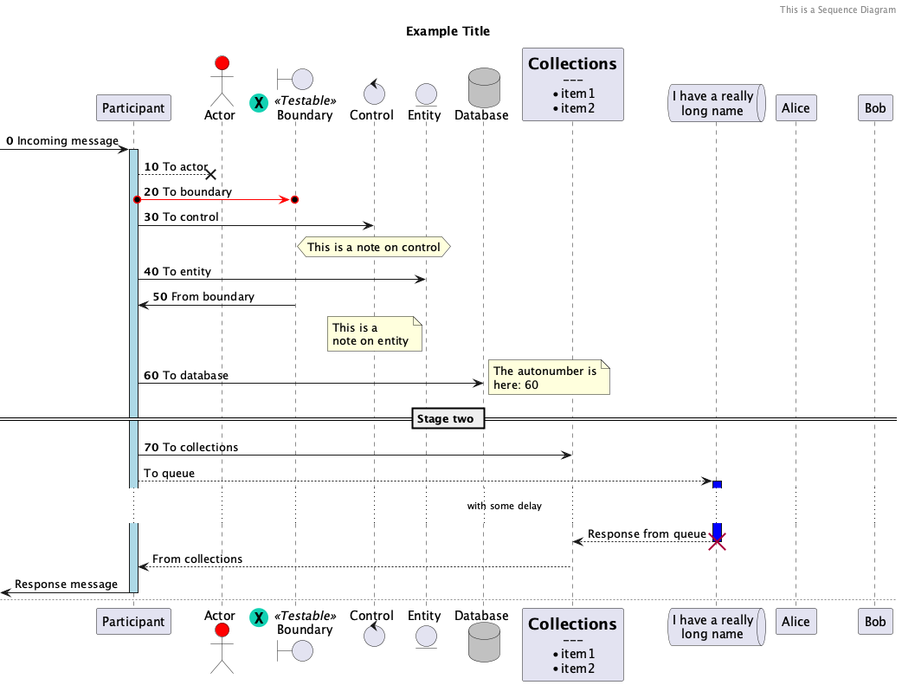
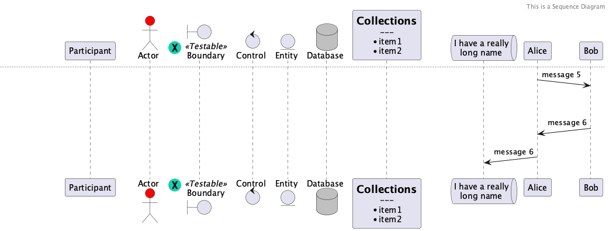
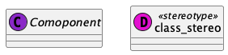
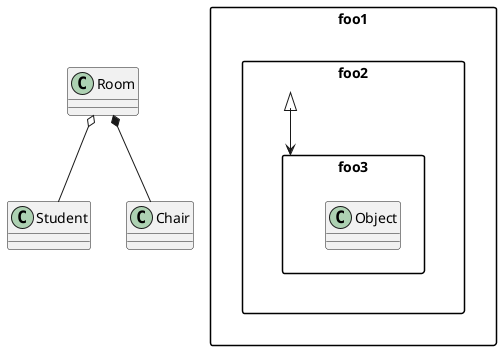
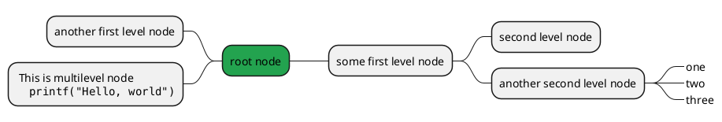

## Sequence Diagram



<details>
  <summary>PlantUML Source</summary>

  ```plantuml
  @startuml sequence_diagram
  header This is a Sequence Diagram
  title Example Title
  skinparam responseMessageBelowArrow true
  autonumber 0 10
  participant Participant as Foo
  actor Actor #red
  boundary Boundary as Foo2 << (X,#12D1B2) Testable >>
  control Control as Foo3
  entity Entity as Foo4
  database Database as Foo5 #silver
  participant Collections [
    = Collections
    ---
    * item1
    * item2
  ]

  queue "I have a really\nlong name" as Foo7
  [->  Foo ++ #lightblue: Incoming message
  Foo --x Actor : To actor
  {start} Foo o-[#red]>o Foo2 : To boundary
  Foo -> Foo3 : To control
  hnote over Foo3: This is a note on control
  Foo -> Foo4 : To entity
  {end} Foo <- Foo2: From boundary
  {start} <-> {end}: Response from boundary
  note left of Foo4: This is a \nnote on entity
  Foo -> Foo5 : To database
  note right
    The autonumber is
    here: %autonumber%
  end note
  == Stage two ==
  Foo -> Collections : To collections
  autonumber stop
  Foo --> Foo7: To queue
  activate Foo7 #blue
  ... with some delay ...

  Collections <-- Foo7: Response from queue
  destroy Foo7
  Foo <-- Collections : From collections
  [<- Foo --: Response message

  newpage
  hide unlinked
  skinparam responseMessageBelowArrow false
  Alice ->(10) Bob : message 5
  ||43||
  Alice (10)<- Bob : message 6
  Foo7 (10)<- Alice  : message 6

  @enduml
  ```
</details>


<details>
  <summary>PlantUML Source</summary>

  ```plantuml
  @startuml class_diagram
  abstract Comoponent << (C, #8a28c7) >>
  class class_stereo <<(D,  #E310D0) stereotype>>
  @enduml
  ```
</details>





