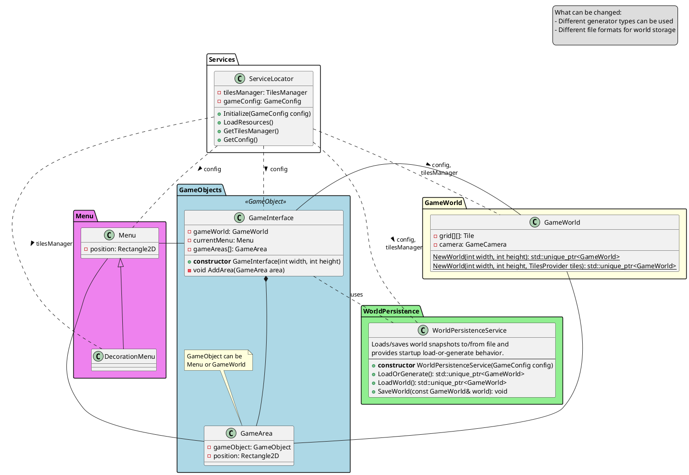
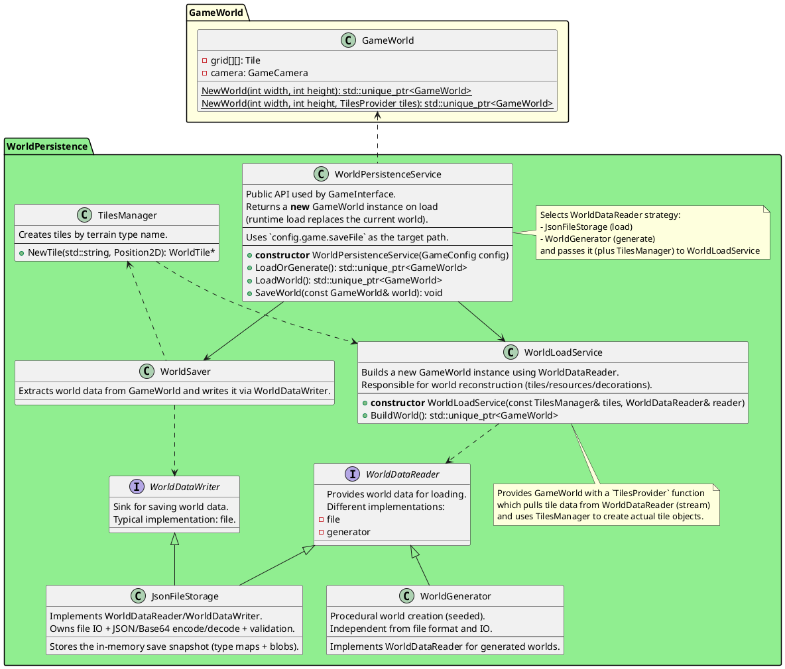
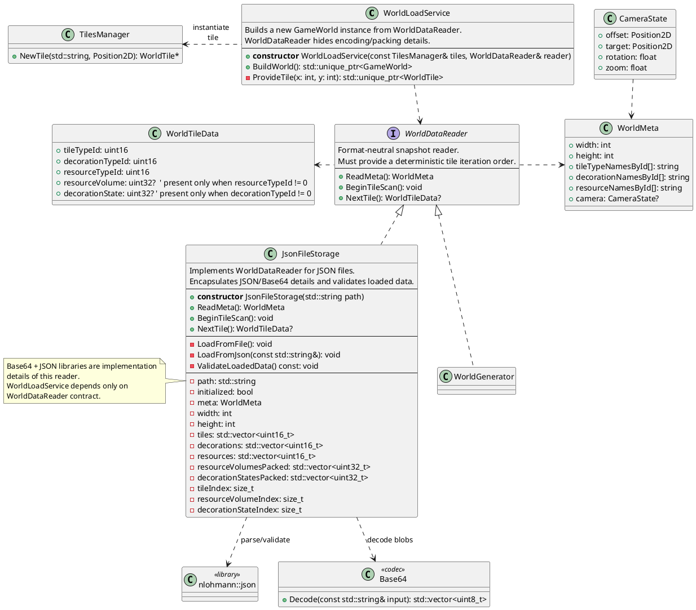
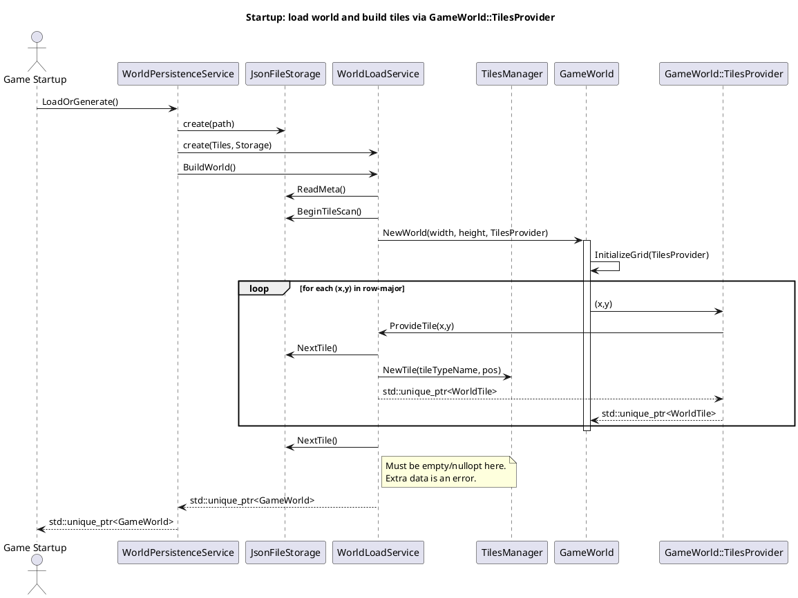

## World Persistance System

### General Place in the System



### World Persistence Design Rules

- `WorldDataReader`/`WorldDataWriter` must expose a format-neutral data contract (tile type maps + blobs + packed state arrays), not JSON/Base64 details.
- World packing rules (e.g., state arrays stored only for non-zero ids) must live in exactly one place per strategy:
  - file strategy: `JsonFileStorage`
  - generation strategy: `WorldGenerator`
- `WorldLoadService` must stay free of encoding/persistence knowledge: it only consumes `WorldDataReader` and produces a new `GameWorld`.
- `WorldPersistenceService` is the policy owner: decides which `WorldDataReader` strategy to use (load vs generate) and triggers save/load via hotkeys/startup.

### World persistence service details



### World Loader Interface



#### Contract Notes (for WorldDataReader)

- `ReadMeta()` must fully describe the world dimensions and provide id->name lookup arrays for tile/decor/resource ids.
- `BeginTileScan()` + `NextTile()` must produce exactly `width * height` tiles in <b>row-major</b> order (y=0..H-1, x=0..W-1).
- `NextTile()` must hide packing rules:
  - If `resourceTypeId == 0`, `resourceVolume` must be omitted/empty.
  - If `decorationTypeId == 0`, `decorationState` must be omitted/empty.
- Errors should be actionable (e.g., “unknown tileTypeId=7 at index 1234”).

### Startup (Load-or-Generate)


### Proposed File Format (JSON, versioned)

Reuse the existing `nlohmann/json` dependency (already used by `GameConfig`) for:
- Human-readable saves during development
- Strict validation + actionable errors

#### Schema v1 (tileTypes + binary tile map)

Do not store tiles as `{x,y}` objects. For large worlds this is too big and too slow to parse.

Instead:
- `tileTypes` maps tile type name → integer id.
- `tiles` stores the per-cell tile type id as a binary blob serialized in row-major order.
- Do the same for per-tile decoration/resource: define `decorationTypes` / `resourceTypes`, then store per-tile ids as binary.
- Use the `decorations` / `resources` arrays themselves as the mask: store extra state arrays only for tiles where the id is non-zero (packed, row-major scan order).
- Because the container is JSON, binary is stored as Base64 text.

Example schema (v1):

```json
{
  "saveVersion": 1,
  "world": {
    "width": 60,
    "height": 80,
    "tileTypes": {
      "Deep Water": 0,
      "Plains": 1,
      "Grassland": 2
    },
    "decorationTypes": {
      "Grass": 1,
      "Rock": 2,
      "Wall": 3,
      "Tree": 4,
      "Road": 5
    },
    "resourceTypes": {
      "Coil": 1,
      "Clay": 2,
      "Iron": 3,
      "Copper": 4
    },
    "encoding": {
      "order": "row-major",
      "valueType": "u16",
      "endianness": "little",
      "codec": "base64"
    },
    "tiles": "AAABAAIAAAEAAQACAAIA..."
    ,
    "decorations": "AAAAAAQAAAABAAIAAAAD..."
    ,
    "resources": "AAAAAAEAAAADAAAAAAIA..."
    ,
    "resourceVolumes": "AAAAAAoAAAAAFAAAAA=="
    ,
    "decorationStates": "AAAAAAEAAAACAAAAAA=="
  },
  "camera": {
    "offset": { "x": 0.0, "y": 0.0 },
    "target": { "x": 0.0, "y": 0.0 },
    "rotation": 0.0,
    "zoom": 1.0
  }
}
```

Notes:
- Store `x/y` as integer grid coordinates; reconstruct `WorldTile::Pos` using `x + 0.5f`, `y + 0.5f` to match current initialization.
- Tile position is implicit by index: `index = y * width + x`.
- `encoding` applies to `tiles`, `decorations`, `resources`, and `resourceVolumes` (do not repeat per-field).
- `resourceVolumes` uses `u32` even when `encoding.valueType` is `u16` (it’s always `u32 little-endian` in v1).
- `decorationStates` uses `u32 little-endian` in v1.
- `valueType` is `u16` to keep v1 simple and robust.
- `decorationTypeId == 0` and `resourceTypeId == 0` are reserved for “no decoration/resource”.
  - Type maps may omit id 0; the reader treats it as empty.
- `resourceVolumes` is packed: it contains values only for tiles where `resources[i] != 0`, in row-major scan order.
- `decorationStates` is packed: it contains values only for tiles where `decorations[i] != 0`, in row-major scan order.
- We can add `compression` later (e.g. `zstd`) as an optional, layered step: `raw bytes -> compress -> base64`.

---
